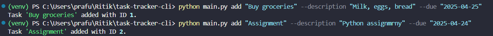
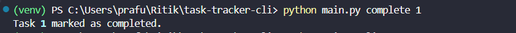
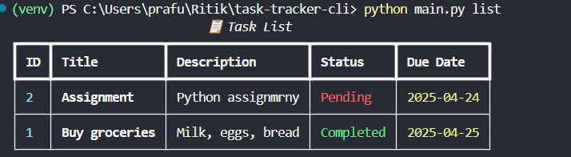
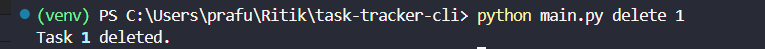

# ✅ Task Tracker CLI

A lightweight and easy-to-use **Command-Line Interface (CLI)** tool for managing your daily tasks!  
Built with Python, this simple task tracker lets you **add**, **list**, **complete**, and **delete** tasks using just a few commands.

---

## 🧩 Features

- 🆕 Add new tasks with descriptions and due dates
- 📋 List all tasks in a neat format
- ✅ Mark tasks as completed
- 🗑️ Remove completed or irrelevant tasks
- 💾 Tasks are saved in a `tasks.json` file
- 🔄 Option to reset the task list

---

## 📁 Project Folder Structure

```
task_tracker/
│
├── main.py # CLI entry point
├── task_manager.py # Functions to add, viewm delete, mark complete
├── storage.py # Functions to read/write JSON file
├── tasks.json # Stores task data
└── README.md # Instructions & how to run
```

## 🖼️ Demo / Screenshot









---

## 🚀 Getting Started

Follow these simple steps to set up and start using the Task Tracker CLI.

### ✅ 1. Navigate to Project Folder

```bash
cd path/to/task_tracker
```

### 🐍 2. Set Up Virtual Environment

```bash
python -m venv venv
```

```bash
source venv/bin/activate # For Linux/Mac
# OR
venv\Scripts\activate # For Windows
```

### 3. Install Dependencies

```bash
pip install -r requirements.txt
```

### ⚙️ 4. Run the CLI App

#### 🆕 Add a Task

```bash
python main.py add "Buy groceries" --description "Milk, eggs, bread" --due "2025-04-25"
```

#### 📋 List Tasks

```bash
python main.py list
```

#### ✅ Mark Task as Completed

```bash
python main.py complete 1
```

#### 🗑️ Delete Task

```bash
python main.py delete 1
```

### 🧼 5. (Optional) Reset Task File

```bash
echo "[]" > tasks.json
```
